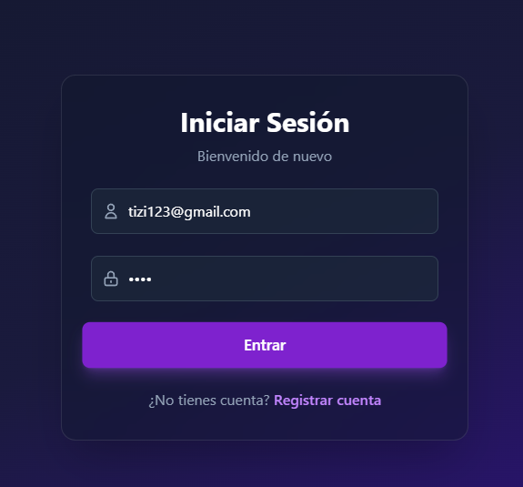
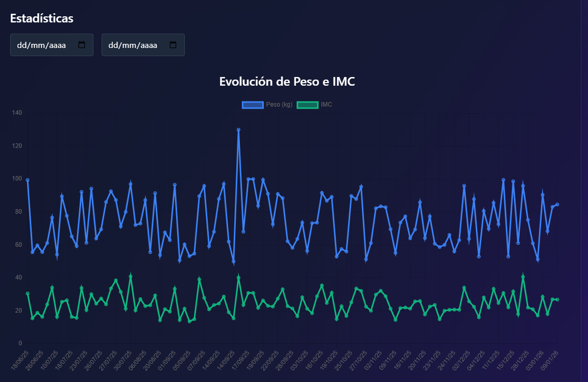
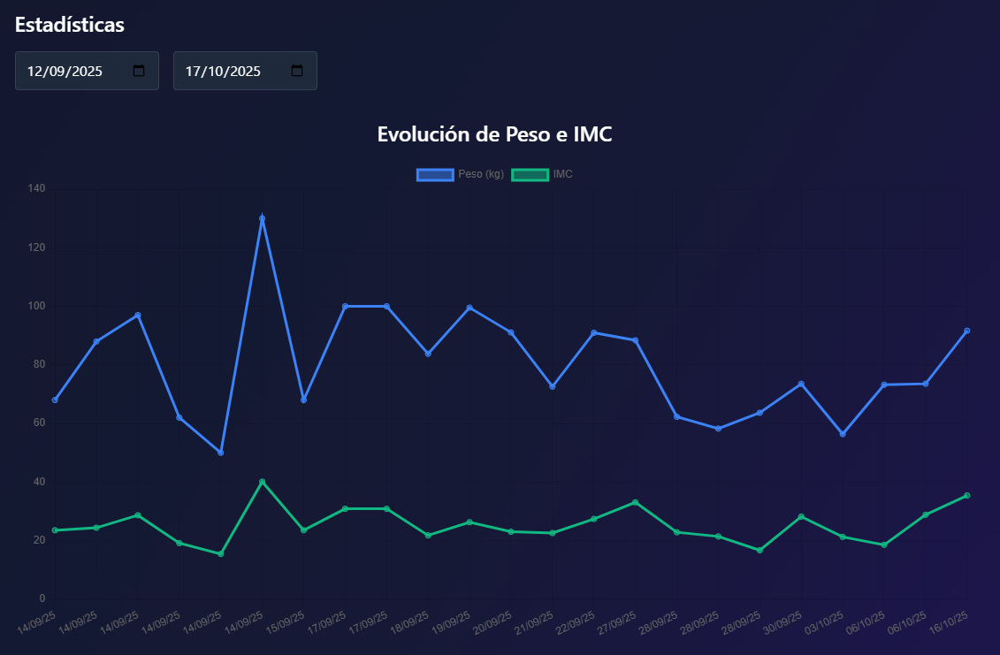
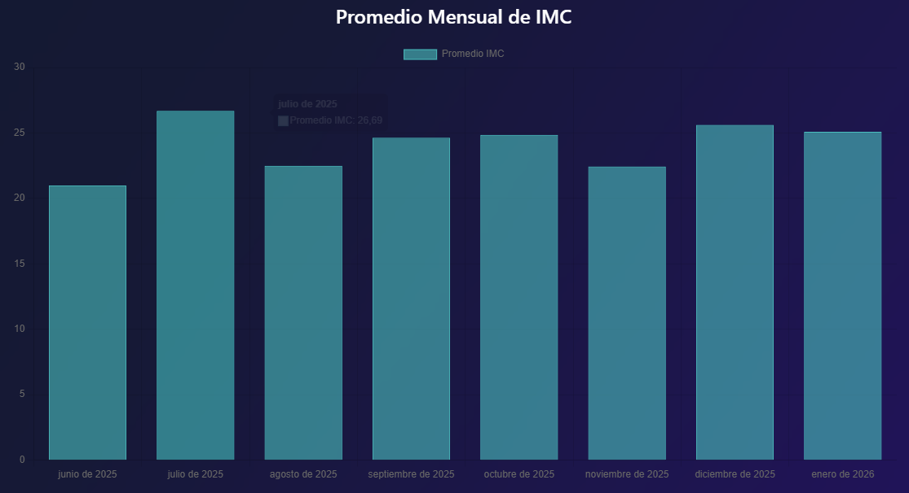
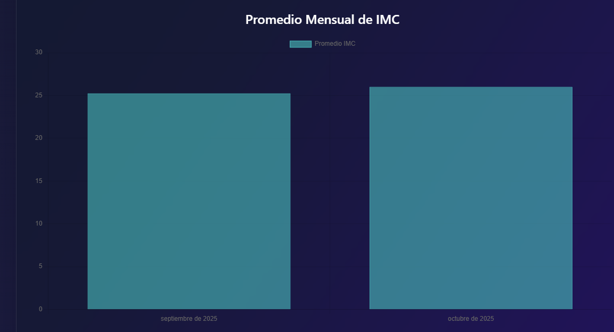
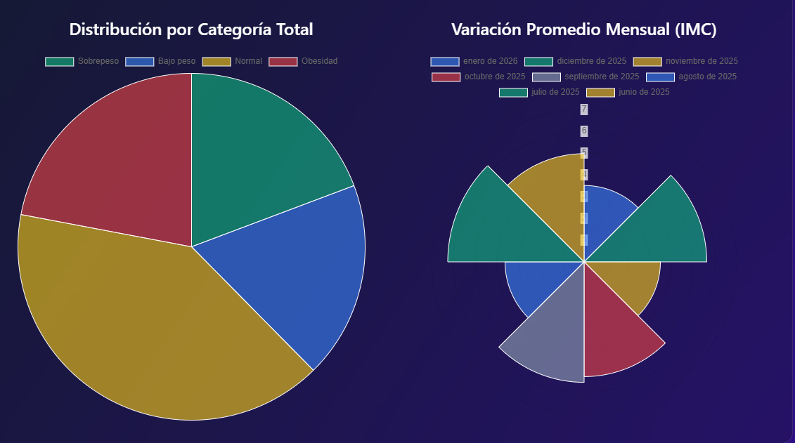

##  Calculadora IMC

## Link
https://2025-proyecto1-imc.vercel.app/

## Inicio
En primera instancia, se procedió a clonar los repositorios provistos por el docente a cargo de la asignatura.
Posteriormente, se creó un nuevo repositorio en GitHub con el nombre:

2025_proyecto1_imc

Finalmente, se subieron los archivos del proyecto a dicho repositorio.

--- 
En la segunda instancia, se nos pidió cambios para realizarle al proyecto, dentro de estas modificaciones se encontraban: 
- Validaciones en el ingreso de datos para el formulario:
    - Validar que el peso sea un número positivo mayor a 0 y menor a 500 kg.
    - Validar que la altura sea un número positivo mayor a 0 y menor a 3 metros.
    - Mostrar mensajes de error amigables en el frontend

- Implementación de persistencia para que los usuarios puedan guardar y recuperar sus resultados, con una interfaz simple
en el frontend para visualizar el historia.

- Establecer la autenticación para asociar cálculos de IMC a usuarios específicos.

## Dependencias
Tanto en el backend como en el frontend, fue necesario instalar las dependencias iniciales mediante el siguiente comando:

"npm install"

## Ejecución local de pruebas
Con el objetivo de comprobar el correcto funcionamiento del sistema de forma local, se abrieron dos terminales independientes:

**Backend**
"npm run start:dev"

**Frontend**
"npm run dev"
---
Segunda entrega:
Empezamos a utilizar taiwind para el frontend por lo que debimos instalarlo "npm install tailwindcss @tailwindcss/vite"

## Despliegue de frontend a Vercel
Para el despliegue del frontend se optó por la plataforma Vercel ya que su plan gratuito cubre las necesidades de  un proyecto academico,nos parecio fácil de usar y además  un compañero ya tenia experiencia utilizándolo.
 Para el despliegue seguimos los pasos que se enumeran a continuación:

Se vinculó el repositorio en la plataforma.

Se especificó la carpeta frontend como directorio de despliegue.

Se configuraron los parámetros principales:

Framework: Vite

Build command: npm run build

A efectos de realizar pruebas previas a un despliegue definitivo, se creó la rama test, en la cual se llevaron a cabo las siguientes acciones:

Creación del archivo .env en la carpeta frontend para alojar la URL de la API del backend.

Modificación del código en los archivos main.tsx e ImcForm.tsx, incorporando la llamada a la API.

---
En cuanto a la segunda entrega el despliegue del frontend a Vercel fue el mismo, solamente que modificamos un "/" de la variable de entorno ya que teníamos problema con la comunicación del backend.

## Despliegue de backend a Render
El despliegue del backend se realizó en la plataforma Render ya que su plan gratuito permite desplegar el back-end y la base de datos sin costos, nos resultó sencillo de usar y además ofrece buena confiabilidad para mantener el proyecto accesible.
El procedimiento contempló:

Vinculación del repositorio con Render.

Configuración del servicio para que se enfocara en la carpeta backend.

---
Para la segunda entrega configuramos Render para que haga los despliegues en la rama de "test" y le cambiamos las variables de entorno para que se pueda comunicar con la base de datos.

## Base de datos
Utilziamos el servicio de SupaBase, el mismo  nos proporcionó las variables de entorno para copiar y pegar en nuestro proyecto así se conectaba con nuestro backend.
Luego creamos las tablas "users" e "imc_records" para poder guardar los datos que se nos había pedido para esta entrega: 
- peso(kg), altura (m), IMC calculado, categoría (bajo peso, normal, sobrepeso, obesidad), y fecha/hora del cálculo
- id, email, password, fecha y hora de creación del usuario

## Problemas 
Se presentó inicialmente un problema: Render estaba configurado por defecto para desplegar la rama main, mientras que los cambios efectuados se encontraban en la rama test.
Tras identificar esta situación, se ajustó la configuración para que el servicio utilizara la rama correcta. Una vez realizado el cambio, el despliegue funcionó correctamente.

---
En la segunda entrega tuvimos problemas específicos, ya que al principio hubo una mala estructuración del proyecto (creamos carpeta de componentes, modulos, auth, etc...). Luego a la hora de conectar la base de datos con el backend tuvimos problemas con los nombres de las entidades ya que había mayúsculas y minúsculas mezcladas por lo que no se podía comunicar correctamente. 

## Resultados obtenidos manualmente
El sistema quedó desplegado con el frontend en Vercel y el backend en Render, funcionando de manera integrada.
Se realizaron pruebas manuales sobre la aplicación desplegada, las cuales confirmaron el correcto funcionamiento de la solución propuesta.

## Bajo peso

## Peso normal

## Obeso

## Sobrepeso
 

---

## Segunda entrega
Finalmente los tests manuales que hicimos para la segunda entrega, fue el registro y login por parte del usuario; luego para ese usuario poder calcular los IMC con los datos que ingresó y guardarlos en un historial. 
También hicimos un test automático para corroborar el registro en la base de datos.

## Registro

## Login

## Error login

## Home IMC sin datos

## Home IMC con datos guardados

## Base de datos

## Tercera entrega
Para esta entrega tuvimos como desafió agregar estadísticas para el usuario. En este caso nos basamos en poder mostrar:
- La evolución del IMC y/o peso a lo largo del tiempo, basado en los cálculos almacenados.
- Implementar consultas agregadas para calcular métricas como promedio, variación y conteo de cálculos por categoría.

En este caso, utilizamos el framework de Chart.js para poder hacer la visualización de estadísticas ya que Metabase daba la opción de usarlo gratis pero por 14 días, por lo que optamos por la opción gratuita sin tener riesgos a futuro. 
A continuación les dejamos imagenes de como quedaron las estadísticas dentro del usuario tizi123@gmail.com que fue el mostrado en la presentación anterior
Para generar todas estas estadísticas, generamos 100 cálculos dentro de la base de datos para poder tener más instancias a lo largo de los días. Lo hicimos desde Junio 2025 hasta Diciembre 2025.

## Evolución peso e IMC 

## Evolución peso e IMC con fechas filtradas

## Promedio mensual de IMC

## Promedio mensual de IMC con fechas filtradas

## Distribución y Variación 

